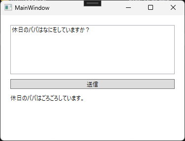

## 概要

自作のAIチャットクライアントアプリから、自作のMCPサーバーを使うサンプルアプリ。 
以下のものを含む。

- AIChatJikken（自作AIチャットアプリ）
- MyMcpServer（MCPサーバー）

## 動かし方

- VisualStudio2022で、AIChatJikkenソリューションをデバッグ構成でビルドする。
- slnと同じ階層にある「CopyMcp.bat」をダブルクリックして実行する。
	- "C:\Program Files\MyMcpServer"フォルダに、MCPサーバーのexe一式が配置される。
- VisualStudio2022から、AIChatJikkenのプロジェクトをデバッグ実行(F5)する。
  もしくは、ビルド成果物の中のAIChatJikken.exeをダブルクリックして実行する。
- 「パパの休日の過ごし方は？」という意味の文章を入する。
- 「ここにgithub modelsのキーを入れてください」と出ている欄に、github modelsのキーを入れる。
- 送信を押す。
  - そうすると、MCPサーバーのほうに書いた家族の過ごし方を返してくれる。  
    （ママは？と聞くとママのことを返してくれる）

