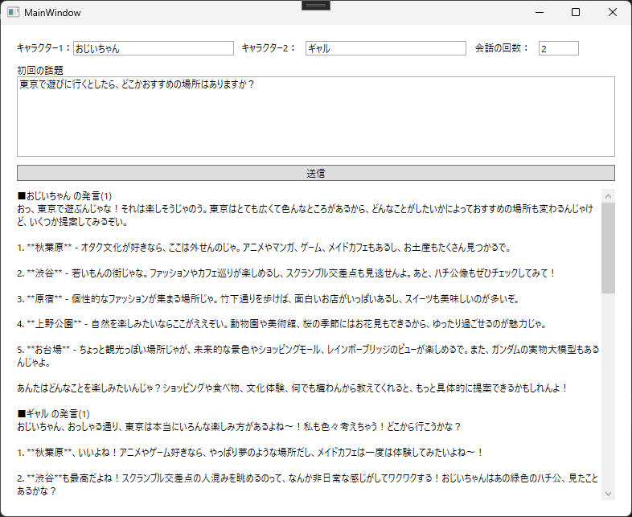
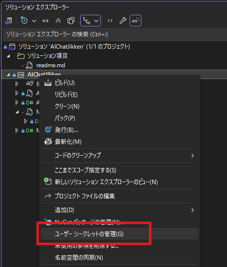

## 概要

おじいちゃんとギャルのチャットクライアントが口論するアプリ

## 構成

- AI関連
  - Azure OpenAI使用
  - モデル：gpt-4o-mini
- プログラミング
  - WPFアプリ
  - Microsoft.Extensions.AI使用

## アプリ仕様

画面



仕様

- 「キャラクター1」のテキストボックスに書いたキャラのチャットクライアントと、
- 「キャラクター2」に書いたチャットクライアントが、
- 「初回の話題」に書いた話題について、
- 「会話の回数」に書いた回数(ターン)だけ、会話をする。
- 「送信」を押すと、会話を開始する。

## コード構成

GithubCopiplotに「このソリューションの構成を教えて」と聞くとよい。  
（聞いたら答えてくれたので書く気をなくした）

## トークンとエンドポイントの設定について

### コード上でトークンとエンドポイントを使っている個所

おじいちゃんとギャルで会話をさせるには、
👇の部分で使用している、自分のAzureOpenAIで登録したトークンとエンドポイントを、プロジェクトの「ユーザーシークレット」として登録しておく設定する必要がある。

```cs
var configuration = new ConfigurationBuilder().AddUserSecrets<MainWindow>().Build();

var credential = new ApiKeyCredential(configuration["AzureOpenAI:Token"]!);
var endpoint = new Uri(configuration["AzureOpenAI:Endpoint"]!);
```

### ユーザーシークレットの設定の仕方

プロジェクトを右クリックして「ユーザーシークレットの管理」を押す。



`secrets.json`が開くので、👇のように設定する。
(xxxxxxの部分に、自分のトークンとエンドポイントを入れる)

```json
{
  "AzureOpenAI:Token": "xxxxxxxxxxxxxxxxxxxxxxxxxxxxxxxxxxxxxxxxxxxxxxxxxxxxxxxxxxxxxxxxxxxxxxxxxxxxxxxxxxxx",
  "AzureOpenAI:Endpoint": "https://xxxxxxxxxxxxx.openai.azure.com/"
}
```

## 悩み

じじいとギャルを口論させるアプリ、と書いた。  
しかし口論させたいのに、どんなinputをしても、口論にならない。  
どうにかして、口汚く罵りあう口論をさせられないだろうか。  
（AIは罵るようなことは無いようになっているのか？）

Clientの作りが悪いか？  
`chatClient!.GetStreamingResponseAsync()`をするときに食わせる、それまでの会話内容が適切でないか？うーん...

## 参考

Azure OpenAIを使って、AIチャットクライアント(C#)を作る（Azure OpenAI手続き編）

https://qiita.com/tera1707/items/a5485f62060268baa2b1

Azure OpenAIを使って、AIチャットクライアント(C#)を作る（WPFアプリ実装編）

https://qiita.com/tera1707/items/6c55b2d63594b5c7fcca

### 備考

面白がって遊んでいたら、結構お金がかかる様子。  
昨日いろいろ試していたら5ドルくらい使っていた...

